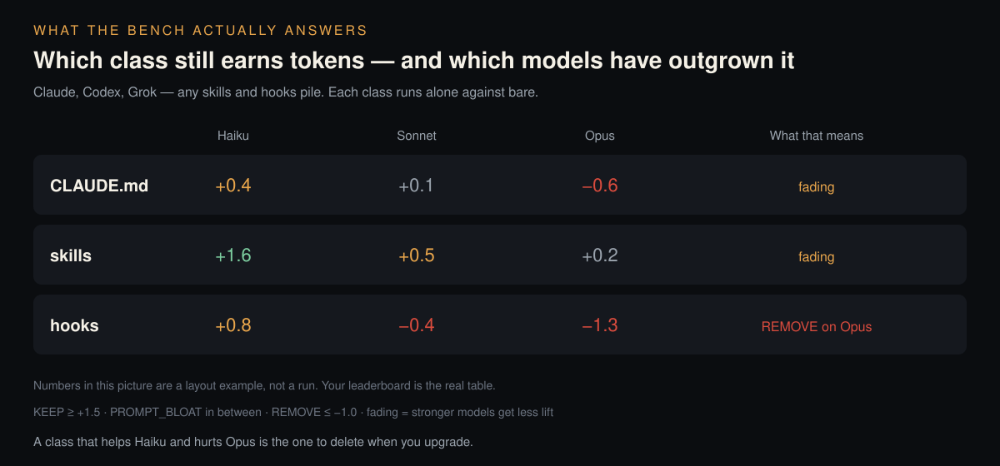
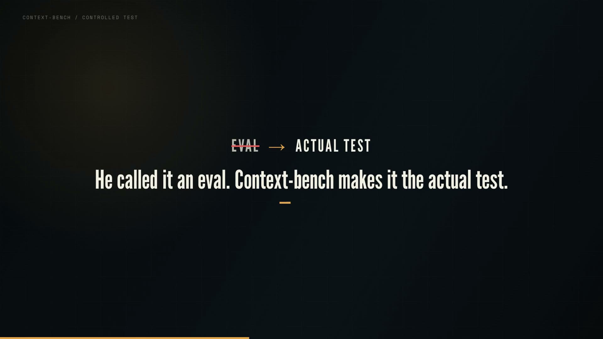

# keep-or-cut

Find which **skills** and **hooks** still help — and which newer models have outgrown.

Works on Claude Code, Codex, Grok, or any LLM tool with a skills / hooks / memory directory. It splits that pile, scores each class **alone** against bare, and prints KEEP / PROMPT_BLOAT / REMOVE.

**No API key for Claude.** Profiles and the judge use your local `claude` CLI (`claude /login`). Grok defaults to the local `grok` CLI the same way; set `XAI_API_KEY` only with `--provider xai`.

## Run it

```bash
git clone https://github.com/YoungMoneyInvestments/keep-or-cut.git
cd keep-or-cut
python3 -m venv .venv && source .venv/bin/activate
pip install -e .

# 30-second smoke
python3 -m keep_or_cut.cli --smoke

# The run that matters
python3 -m keep_or_cut.cli --context-dir ~/.claude
```

Same bench against Codex or Grok (or any other skills/hooks/memory dir):

```bash
python3 -m keep_or_cut.cli --context-dir ~/.codex
python3 -m keep_or_cut.cli --context-dir ~/.grok
```

On a Claude-style home it auto-splits `CLAUDE.md` / `skills` / `hooks` / `agents`. Claude arms run with `--safe-mode`, so ambient `~/.claude` is not in the prompt. Each class is injected once on that isolated base. Hooks that are only code are inventoried, not executed. Slash-invoke (`--harness skill`) cannot use `--safe-mode` because that flag disables skills.

Read down a column. If a stronger model is worse on `hooks`, that is the class to delete when you upgrade.

| Call | When |
|---|---|
| **KEEP** | Δ ≥ +1.5 — that class earns its tokens |
| **PROMPT_BLOAT** | in between — barely moved the score |
| **REMOVE** | Δ ≤ −1.0 — the model got worse with it |
| **fading** | stronger models get less lift than weaker ones |

Writes `results/dashboard.html` (class × model, painted KEEP / PROMPT_BLOAT / REMOVE) and `results/leaderboard_<ts>.md`. Open the HTML. Deltas are paired by case. If any Case × Profile cell fails, the process exits 2, still writes the dashboard as an incomplete skeleton, and does not print KEEP/REMOVE.

<p align="center">
  
</p>

That picture is the **shape** of the output, not a scored run. Your table is the one in `results/`.

GitHub’s file viewer will not play this mp4. Watch it here:

<p align="center">
  <a href="https://youngmoneyinvestments.github.io/keep-or-cut/watch.html">
    
  </a>
</p>

**[Play the 51s film](https://youngmoneyinvestments.github.io/keep-or-cut/watch.html)** · [16:9 mp4](https://youngmoneyinvestments.github.io/keep-or-cut/assets/keep-or-cut.mp4)

## More commands

```bash
# One class family, one model
python3 -m keep_or_cut.cli --context-dir ~/.claude --split families --models opus

# One skill directory (must contain SKILL.md at its root)
python3 -m keep_or_cut.cli --context-dir ~/.claude/skills/example-skill --harness skill --models haiku

# Subscription CLIs, no API keys
python3 -m keep_or_cut.cli --models sonnet,haiku,grok,codex,cursor,gemini --smoke
```

### Flags

| Flag | What it does |
|---|---|
| `--context-dir PATH` | Bundle to test. Repeatable. Default: `examples/context`. |
| `--split auto` | Default. A Claude home becomes `+all` plus `claude.md` / `skills` / `hooks` / `agents`. |
| `--split classes` | Force that four-class split. |
| `--split families` | Skills grouped by shared name prefix. |
| `--split skills` | One profile per skill directory. |
| `--split off` | Whole directory as one blob. |
| `--wrap fair` | Default. Case is the user message; skills and hooks are optional system context. |
| `--wrap system` | Skills and hooks as a raw system prompt. |
| `--wrap raw` | Old `"System Instructions:"` user-turn wrap (kept for back-compat). |
| `--harness auto` | Default. Skill dirs (`SKILL.md`) use slash-invoke; prose dirs use wrap. |
| `--harness skill` | Force slash-invoke (`claude -p /skillname`). Bare arm gets `--disable-slash-commands`. |
| `--harness notes` | Always dump markdown as extra system text (old behavior). |
| `--models opus,sonnet,haiku` | Also: `grok`, `codex`, `cursor`, `gemini`, or `provider:model-id`. |
| `--provider auto` | Default. Subscription CLIs (`claude`/`codex`/`grok`/`cursor`/`gemini`). Use `anthropic`/`openai`/`xai` for billed APIs. |
| `--smoke` | First Case × first model. Use this before a 6×3×N burn. |

## Read the numbers honestly

The judge is a model call, not ground truth. Read a few `results/judged_*.json` reasons before trusting a delta. Ten Cases is a smoke bench, not a statistically powered one. If a Profile swings on 1–2 Cases, that is noise.

**Skill dirs use real Claude Code slash-invoke by default** (`--harness auto` / `--harness skill`): `claude -p /skillname` with the Case as the rest of the prompt ([ADR 0004](./docs/adr/0004-fair-cli-wrapping.md)). Prose bundles (`CLAUDE.md`, `examples/context`) still wrap as system context. `--harness notes` forces the old dump.

**Hooks that are only code** are inventoried as names, not executed. The class still shows up. A hook that never writes markdown cannot be scored as context — it is scored as "does reminding the model these hooks exist help," which is a weak test and labeled that way.

**`bare` is not zero-context.** `claude -p` still loads your ambient `~/.claude` config on every Profile, including `bare`. The constant cancels out of the delta. Absolute scores are *your* scores ([ADR 0003](./docs/adr/0003-bare-is-relative-to-ambient-config-under-oauth.md)).

Vocabulary: [`CONTEXT.md`](./CONTEXT.md).

## Adding Cases

Drop a YAML file in `cases/`:

```yaml
category: coding
prompt: |
  <the task>
rubric:
  - <criterion the judge should check>
```

## Why

Anthropic deleted ~80% of Claude Code's own system prompt when Opus 5 shipped. The model got better. Boris Cherny's follow-up: do the same thing to *your* stack every six months, then add back only what you watch fail. [Nate Herk's video](https://youtu.be/XNQBCRcwXV4) is what made that advice circulate.

A whole-home REMOVE is not actionable. "hooks are fading on Opus, skills still pay on Haiku" is.

Source clips in the film: [Boris at YC Startup School](https://www.youtube.com/watch?v=qyPCVqFUyDo) · [Nate Herk](https://youtu.be/XNQBCRcwXV4). Short attributed excerpts; the rest is this project's explainer.

## License

MIT
